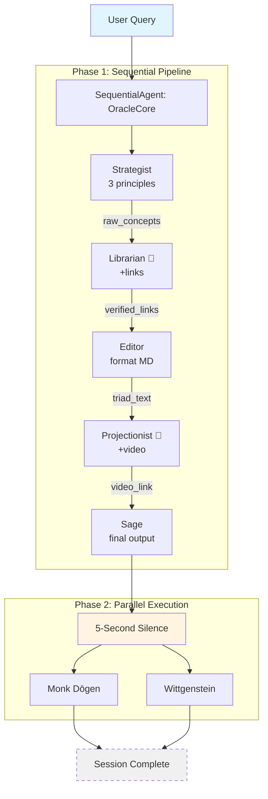

# Product Requirements Document (PRD)
# Buddhist Oracle

**Project Name:** Buddhist Oracle  
**Track:** Freestyle (unique/experimental)  
**Tagline:** *"Wisdom through Silence - Distill any topic to its essence"*  
**Version:** 2.0  
**Last Updated:** November 30, 2025

---

## 1. Executive Summary

### Vision Statement
Buddhist Oracle transforms information overload into clarity by distilling complex topics into three fundamental first principles, then inviting users into contemplative silence. It's the anti-LLM: concise, complete, and conversation-ending.

### The Problem
Modern AI assistants are verbose by design—endless conversations when clarity requires few words. Users face:
- **Information Overload:** Too much content, not enough clarity
- **Lost Fundamentals:** Surface-level explanations miss core principles
- **Conversation Fatigue:** Multi-turn dialogues when single answers suffice

### The Solution
Inspired by Zen philosophy: **maximum insight through minimum words, followed by silence**.

| What Users Get | How It Works |
|----------------|--------------|
| 3 First Principles | Strategist agent extracts fundamentals |
| Curated Resources | Librarian validates with Google Search |
| Visual Learning | Projectionist finds YouTube video |
| Philosophical Closure | Sage ends with "These are the answers." |
| Reflective Questions | Dōgen & Wittgenstein prompt deeper thinking |

---

## 2. System Architecture

### 2.1 High-Level Flow

```
┌─────────────────────────────────────────────────────────────────────────┐
│                           BUDDHIST ORACLE                               │
│                     7 Agents • 2 Execution Modes                        │
└─────────────────────────────────────────────────────────────────────────┘

                              User Query
                                  │
                                  ▼
         ┌────────────────────────────────────────────────┐
         │          PHASE 1: SEQUENTIAL PIPELINE          │
         │              (SequentialAgent)                 │
         │                                                │
         │  ┌──────────┐   ┌──────────┐   ┌──────────┐   │
         │  │Strategist│ → │Librarian │ → │  Editor  │   │
         │  │          │   │  🔧      │   │          │   │
         │  │3 concepts│   │+links    │   │format MD │   │
         │  └──────────┘   └──────────┘   └──────────┘   │
         │                       │                        │
         │  ┌──────────────┐    ▼     ┌──────────────┐   │
         │  │Projectionist │ ──────── │    Sage      │   │
         │  │     🔧       │          │ final output │   │
         │  │  +video      │          │ + closure    │   │
         │  └──────────────┘          └──────────────┘   │
         └────────────────────────────────────────────────┘
                                  │
                                  ▼
                          * 5-Second Silence *
                                  │
                                  ▼
         ┌────────────────────────────────────────────────┐
         │          PHASE 2: PARALLEL PHILOSOPHERS        │
         │              (asyncio.gather)                  │
         │                                                │
         │     ┌─────────────┐       ┌─────────────┐     │
         │     │ Monk Dōgen  │       │ Wittgenstein│     │
         │     │  Zen koan   │       │  Language   │     │
         │     │  question   │       │  question   │     │
         │     └─────────────┘       └─────────────┘     │
         └────────────────────────────────────────────────┘
                                  │
                                  ▼
                         Session Complete
                        (No follow-up prompts)

🔧 = Uses Google Search tool
```

### 2.2 Mermaid Diagram



### 2.3 Agent Details

| Agent | Role | Tools | Output Key |
|-------|------|-------|------------|
| **TheStrategist** | Extract 3 first principles | — | `raw_concepts` |
| **TheLibrarian** | Find authoritative sources | `google_search` | `verified_links` |
| **TheEditor** | Format as Markdown list | — | `triad_text` |
| **TheProjectionist** | Find YouTube video | `google_search` | `video_link` |
| **TheSage** | Present final answer + closure | — | Final output |
| **MonkDōgen** | Ask Zen koan question | — | — |
| **LudwigWittgenstein** | Ask language/meaning question | — | — |

---

## 3. Technical Implementation

### 3.1 Key Concepts Demonstrated (3/3 ✅)

| # | Concept | Implementation |
|---|---------|----------------|
| 1 | **Multi-Agent (Sequential)** | `SequentialAgent` with 5 sub-agents passing state via `output_key` |
| 2 | **Multi-Agent (Parallel)** | `asyncio.gather()` runs Dōgen + Wittgenstein simultaneously |
| 3 | **Tools + Sessions** | `google_search` tool + `InMemoryRunner` with session management |

### 3.2 Technology Stack

| Component | Technology |
|-----------|------------|
| Framework | Google ADK (Agent Development Kit) |
| LLM | Gemini 2.5 Flash |
| Tools | Google Search (built-in ADK) |
| Sessions | `InMemoryRunner` with session IDs |
| Error Handling | Exponential backoff (5 retries) |
| Async | Python `asyncio` |

### 3.3 Code Structure

```
buddhist-oracle/
├── agent.py         # 7 agent definitions
├── main.py          # Runner, CLI, async execution
├── requirements.txt # google-adk, google-generativeai, python-dotenv
├── PRD.md           # This document
└── README.md        # Setup & usage guide
```

### 3.4 Dependencies

```
google-adk>=0.1.0
google-generativeai>=0.3.0
python-dotenv>=1.0.0
```

---

## 4. User Experience

### Sample Output

```
══════════════════════════════════════════════════════
 BUDDHIST ORACLE - FIRST PRINCIPLES AGENT
══════════════════════════════════════════════════════

What topic do you seek to understand? > How does blockchain work?

[The Oracle is contemplating...]

1. **Decentralization** - No single authority controls the network.
   → https://ethereum.org/decentralization

2. **Cryptographic Hashing** - Data integrity through one-way functions.
   → https://www.investopedia.com/crypto-hash

3. **Consensus Mechanisms** - Network agrees on valid transactions.
   → https://consensys.net/consensus-explained

**Visual Guide:** https://youtube.com/watch?v=blockchain-explained

*These are the answers.*
In silence, understanding deepens.

                    * Silence *

──────────────── The Masters Speak ────────────────

Monk Dōgen asks:
"When you speak of 'trust' in a trustless system, 
 where does your body feel that trust reside?"

Ludwig Wittgenstein asks:
"In what language game does 'decentralized' 
 gain its meaning—and who taught you to play?"

══════════════════════════════════════════════════════
```

### Design Principles

1. **Minimalism** — Exactly 3 principles, no more
2. **Completeness** — Answer is self-sufficient
3. **Closure** — Ends with "These are the answers"
4. **Reflection** — Philosophers invite deeper thinking

---

## 5. Project Status

| Item | Status |
|------|--------|
| Core agents (7) | ✅ Complete |
| Sequential flow | ✅ Complete |
| Parallel execution | ✅ Complete |
| Google Search tool | ✅ Complete |
| Session management | ✅ Complete |
| Error handling | ✅ Complete |
| README.md | 🔲 To create |
| Submission writeup | 🔲 To create |

---

**End of PRD**
