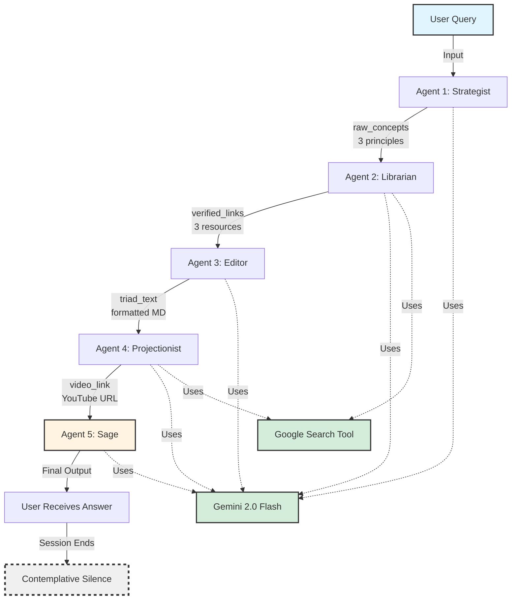

# Product Requirements Document (PRD)
# Buddhist Oracle - First Principles Learning Agent

---
6060
## 📋 Executive Summary
**Project Name:** Buddhist Oracle  
**Competition Track:** Freestyle (unique/experimental)  
**Tagline:** *"Wisdom through Silence - Distill any topic to its essence"*  
**Version:** 1.0  
**Last Updated:** November 28, 2025

### Vision Statement
Buddhist Oracle transforms information overload into clarity by distilling complex topics into three fundamental first principles, then inviting users into contemplative silence rather than endless conversation. It's the anti-LLM: concise, complete, and conversation-ending.

---

## 🎯 Problem Statement

### The Core Problem
Modern AI assistants are verbose by design - they continue conversations indefinitely, generating thousands of words when clarity requires only a few. Users seeking to understand complex topics face:

- **Information Overload:** Too much content, not enough clarity
- **Analysis Paralysis:** Endless refinement cycles prevent understanding
- **Lost Fundamentals:** Surface-level explanations miss core principles
- **Conversation Fatigue:** Multi-turn dialogues when single answers suffice

### User Pain Points
1. **Students/Learners:** "I spend 5 hours researching a topic and still don't grasp the fundamentals"
2. **Decision Makers:** "I need the 3 core factors, not a 10-page analysis"
3. **Overwhelmed Users:** "Every AI keeps talking - I just need the essence and space to think"

### Market Gap
No existing agent focuses on **minimalism + completeness + closure** as a core value proposition.

---

## 💡 Solution Overview

### The Buddhist Oracle Approach
Inspired by Zen philosophy: **maximum insight through minimum words, followed by silence for reflection**.

**Core Philosophy:**
> "These are the answers." (Then silence)

### Value Proposition
**For users who need:** Quick understanding of complex topics  
**Buddhist Oracle provides:** 3 first principles + curated resources + visual learning  
**Unlike traditional LLMs which:** Continue conversations endlessly  
**Our approach:** Delivers complete answers, then encourages contemplative silence

### Key Differentiators
1. **Minimalist by Design:** Exactly 3 principles, no more
2. **Conversation-Ending:** No follow-ups, no refinement loops
3. **Multi-Modal Learning:** Text (principles) + Links (depth) + Video (visual)
4. **Curated Quality:** Google Search validation ensures high-authority sources
5. **Philosophical Framing:** Wisdom tradition meets modern AI

---

## 👥 Target Users

### Primary Persona: "The Seeker"
- **Demographics:** Students, lifelong learners, professionals (25-45 years old)
- **Goals:** Understand complex topics quickly without rabbit holes
- **Pain Point:** "I lose hours researching and end up more confused"
- **Success Metric:** "I understood the core in 2 minutes and know where to go deeper"

### Secondary Persona: "The Overwhelmed Decision Maker"
- **Demographics:** Managers, entrepreneurs, busy parents
- **Goals:** Get to the essence fast for informed decisions
- **Pain Point:** "AI tools give me 10 paragraphs when I need 3 bullet points"
- **Success Metric:** "I made a decision confidently with minimal research time"

---

## 🏗️ System Architecture

### High-Level Architecture

```
┌─────────────────────────────────────────────────────────────────────┐
│                         BUDDHIST ORACLE                              │
│                      (Sequential Agent System)                       │
└─────────────────────────────────────────────────────────────────────┘
                                    │
                                    ▼
                    ┌───────────────────────────┐
                    │    User Input (Query)     │
                    │  "How does blockchain     │
                    │      work?"               │
                    └───────────────┬───────────┘
                                    │
                                    ▼
        ┌───────────────────────────────────────────────────┐
        │           AGENT 1: THE STRATEGIST                 │
        │  ┌─────────────────────────────────────────────┐  │
        │  │ Role: First Principles Thinker              │  │
        │  │ Model: Gemini 2.0 Flash                     │  │
        │  │ Task: Identify 3 core principles            │  │
        │  │ Output: raw_concepts (3 topic titles)       │  │
        │  └─────────────────────────────────────────────┘  │
        └───────────────────┬───────────────────────────────┘
                            │ Passes: ["Decentralization",
                            │          "Cryptographic Hashing",
                            │          "Consensus Mechanisms"]
                            ▼
        ┌───────────────────────────────────────────────────┐
        │           AGENT 2: THE LIBRARIAN                  │
        │  ┌─────────────────────────────────────────────┐  │
        │  │ Role: Research Validator                    │  │
        │  │ Model: Gemini 2.0 Flash                     │  │
        │  │ Tools: Google Search                        │  │
        │  │ Task: Find authoritative sources            │  │
        │  │ Output: verified_links (3 resources)        │  │
        │  └─────────────────────────────────────────────┘  │
        └───────────────────┬───────────────────────────────┘
                            │ Passes: "Topic - Explanation - URL" × 3
                            ▼
        ┌───────────────────────────────────────────────────┐
        │           AGENT 3: THE EDITOR                     │
        │  ┌─────────────────────────────────────────────┐  │
        │  │ Role: Formatter                             │  │
        │  │ Model: Gemini 2.0 Flash                     │  │
        │  │ Task: Create clean Markdown list            │  │
        │  │ Output: triad_text (formatted principles)   │  │
        │  └─────────────────────────────────────────────┘  │
        └───────────────────┬───────────────────────────────┘
                            │ Passes: Formatted markdown list
                            ▼
        ┌───────────────────────────────────────────────────┐
        │         AGENT 4: THE PROJECTIONIST                │
        │  ┌─────────────────────────────────────────────┐  │
        │  │ Role: Visual Learning Curator               │  │
        │  │ Model: Gemini 2.0 Flash                     │  │
        │  │ Tools: Google Search                        │  │
        │  │ Task: Find educational YouTube video        │  │
        │  │ Output: video_link (YouTube URL)            │  │
        │  └─────────────────────────────────────────────┘  │
        └───────────────────┬───────────────────────────────┘
                            │ Passes: YouTube URL
                            ▼
        ┌───────────────────────────────────────────────────┐
        │             AGENT 5: THE SAGE                     │
        │  ┌─────────────────────────────────────────────┐  │
        │  │ Role: Final Presenter & Wisdom Keeper       │  │
        │  │ Model: Gemini 2.0 Flash                     │  │
        │  │ Task: Format final output + invoke silence  │  │
        │  │ Output: Complete answer with closure        │  │
        │  └─────────────────────────────────────────────┘  │
        └───────────────────┬───────────────────────────────┘
                            │
                            ▼
                    ┌───────────────────────────┐
                    │   Final Output to User    │
                    │                           │
                    │ 1. **Decentralization**   │
                    │    [Link + Explanation]   │
                    │ 2. **Cryptographic Hash** │
                    │    [Link + Explanation]   │
                    │ 3. **Consensus Mechanism**│
                    │    [Link + Explanation]   │
                    │                           │
                    │ Visual Guide: [YouTube]   │
                    │                           │
                    │ "These are the answers."  │
                    │ "Silence speaks louder."  │
                    └───────────────────────────┘
                                    │
                                    ▼
                         ┌──────────────────┐
                         │  [End Session]   │
                         │  No follow-ups   │
                         └──────────────────┘
```

### Mermaid Diagram



---

## 🔧 Current Technical Implementation

### Key Concepts Demonstrated (2/3 Required)

#### ✅ 1. Multi-Agent System (Sequential Agents)
- **Implementation:** 5 specialized agents in sequential workflow
- **Pattern:** Linear pipeline with state passing via `output_key`
- **Agents:**
  1. **Strategist** - First principles extraction
  2. **Librarian** - Research validation
  3. **Editor** - Formatting
  4. **Projectionist** - Visual learning curation
  5. **Sage** - Final presentation + closure

#### ✅ 2. Tools (Built-in Google Search)
- **Implementation:** `google_search` tool used by Librarian and Projectionist
- **Purpose:** Real-time information retrieval and validation
- **Integration:** Native ADK tool integration

#### ❌ 3. [MISSING] - Third Key Concept Required

### Technology Stack
- **Framework:** Google ADK (Agent Development Kit) - Python
- **LLM:** Gemini 2.0 Flash Experimental
- **Tools:** Google Search API (built-in ADK tool)
- **State Management:** Output keys for inter-agent communication
- **Error Handling:** HTTP retry configuration (5 attempts, exponential backoff)

### Code Structure
```
buddhist-oracle/
├── agent.py              # Main agent definitions
├── requirements.txt      # Dependencies (google-adk, google-generativeai, python-dotenv)
├── .env                  # API key configuration (excluded from git)
└── [MISSING] README.md   # Documentation
```

---

## 🎯 Functional Requirements

### Core Features

#### FR-1: Principle Extraction
**Priority:** P0 (Must Have)  
**Description:** Extract exactly 3 first principles from any user query  
**Acceptance Criteria:**
- Always outputs exactly 3 principles (no more, no less)
- Principles are fundamental (not surface-level)
- Principles are actionable and concrete
- Output format: Plain text, one per line

#### FR-2: Research Validation
**Priority:** P0 (Must Have)  
**Description:** Find authoritative sources for each principle  
**Acceptance Criteria:**
- One high-quality link per principle
- Links are from reputable sources (.edu, .org, major publications)
- Fallback to Google search URL if no perfect match
- Each link includes one-sentence explanation

#### FR-3: Visual Learning Support
**Priority:** P0 (Must Have)  
**Description:** Provide YouTube video for visual learners  
**Acceptance Criteria:**
- One video related to original query
- Prefer videos with >100k views (quality indicator)
- Fallback to YouTube search URL if no match
- Video is relevant to the overall topic

#### FR-4: Minimalist Presentation
**Priority:** P0 (Must Have)  
**Description:** Format output cleanly with philosophical closure  
**Acceptance Criteria:**
- Markdown numbered list with bold titles
- "Visual Guide" section with video link
- Ends with "These are the answers."
- One final wisdom sentence about silence/reflection
- No invitation for follow-up questions

#### FR-5: Session Closure
**Priority:** P1 (Should Have)  
**Description:** Clear signal that conversation is complete  
**Acceptance Criteria:**
- No conversational hooks or open-ended questions
- Philosophical framing encourages contemplation
- User understands no follow-up is expected

---

## 🚧 Missing Requirements (To Meet Competition Standards)

### Critical Gaps

#### MR-1: Third Key Concept (P0 - BLOCKING)
**Status:** ❌ Not Implemented  
**Impact:** Does not meet minimum competition requirement (3/3 concepts)

**Options for Implementation:**

**Option A: Sessions & Memory** ⭐ RECOMMENDED
- **Implementation Time:** 2-3 hours
- **Value:** Enables multi-turn conversations (contradicts philosophy but shows technical capability)
- **Technical Approach:**
  ```python
  from google.adk.sessions import InMemorySessionService
  from google.adk.runners import Runner
  
  session_service = InMemorySessionService()
  runner = Runner(agent=root_agent, session_service=session_service)
  ```
- **Justification:** Could track user's exploration journey across multiple topics over time
- **Use Case:** "Remember the 3 principles from yesterday about blockchain"

**Option B: Observability (Logging/Tracing)**
- **Implementation Time:** 2-3 hours
- **Value:** Demonstrates production-readiness and debugging capability
- **Technical Approach:**
  ```python
  from google.adk.plugins.logging_plugin import LoggingPlugin
  import logging
  
  logging.basicConfig(level=logging.DEBUG)
  runner = Runner(agent=root_agent, plugins=[LoggingPlugin()])
  ```
- **Justification:** Monitor agent decision-making, track performance, debug failures
- **Use Case:** Analyze which topics fail principle extraction

**Option C: Custom Tools**
- **Implementation Time:** 2-3 hours
- **Value:** Shows advanced tool creation capability
- **Technical Approach:**
  ```python
  from google.adk.tools import Tool
  
  def validate_principle_quality(principle: str) -> dict:
      """Ensure principles meet quality criteria"""
      # Check conciseness, clarity, fundamentalness
      return {"valid": True, "score": 0.95}
  
  quality_tool = Tool(function=validate_principle_quality)
  ```
- **Justification:** Programmatic quality checks for principle extraction
- **Use Case:** Automatically reject vague or surface-level principles

**Option D: Agent Evaluation**
- **Implementation Time:** 3-4 hours
- **Value:** Demonstrates quality assurance and testing rigor
- **Technical Approach:**
  - Create `integration.evalset.json` with test queries
  - Define expected outputs (3 principles per query)
  - Run evaluation suite
- **Justification:** Prove agent reliability and consistency
- **Use Case:** "Agent correctly extracts principles 95% of the time"

#### MR-2: Documentation (P0 - BLOCKING)
**Status:** ❌ Not Implemented  
**Impact:** Automatic -20 points (20% of total score)

**Required Components:**
1. **README.md** with:
   - Problem statement
   - Solution architecture
   - Setup instructions
   - Technical concepts used
   - Architecture diagram
   - Usage examples
2. **Code Comments:**
   - Design rationale for each agent
   - Explanation of sequential flow
   - Error handling strategy
3. **Architecture Diagram:**
   - Visual representation of agent flow
   - Tool integration points
   - State management

#### MR-3: Submission Writeup (P0 - BLOCKING)
**Status:** ❌ Not Implemented  
**Impact:** Cannot evaluate Category 1 (30 points)

**Required Sections:**
1. **Problem & Solution** (300-400 words)
2. **Architecture & Technical Implementation** (400-500 words)
3. **Value Demonstration** (200-300 words)
4. **Build Journey** (200-300 words)
5. **Future Vision** (100-200 words)

#### MR-4: Enhanced Code Comments (P1)
**Status:** ⚠️ Minimal  
**Impact:** Reduces technical implementation score

**Needed:**
- Docstrings for each agent explaining role and purpose
- Inline comments for complex logic
- State flow documentation

---

## 📊 Competition Scoring Projection

### Current Score Estimate (40-50/100)

| Category | Max | Current | Gap | Priority |
|----------|-----|---------|-----|----------|
| **Category 1: The Pitch** | 30 | 10-15 | -15-20 | P0 |
| - Core Concept & Value | 15 | 8-10 | -5-7 | P0 |
| - Writeup | 15 | 2-5 | -10-13 | P0 |
| **Category 2: Implementation** | 70 | 25-30 | -40-45 | P0 |
| - Technical Implementation | 50 | 25-30 | -20-25 | P0 |
| - Documentation | 20 | 0 | -20 | P0 |
| **Bonus Points** | 20 | 5 | -15 | P1 |
| - Gemini Usage | 5 | 5 | 0 | ✅ |
| - Deployment | 5 | 0 | -5 | P2 |
| - YouTube Video | 10 | 0 | -10 | P2 |
| **TOTAL** | 100 | **40-50** | **-50-60** | - |

### Target Score with Improvements (75-85/100)

**Assuming Implementation of:**
1. Sessions & Memory (+3rd concept)
2. Complete README.md
3. Submission writeup
4. Enhanced code comments

| Category | Max | Target | Improvement |
|----------|-----|--------|-------------|
| Category 1 | 30 | 25-28 | +15-18 |
| Category 2 | 70 | 50-57 | +25-32 |
| Bonus | 20 | 5 | 0 |
| **TOTAL** | 100 | **80-90** | **+40-45** |

---

## 🛠️ Implementation Roadmap

### Phase 1: Meet Minimum Requirements (P0 - 8 hours)
**Deadline:** November 29, 2025 EOD

#### Task 1.1: Add Third Key Concept (3 hours)
- **Choose:** Sessions & Memory (recommended)
- **Implementation:**
  1. Add `InMemorySessionService` to agent.py
  2. Create `Runner` with session service
  3. Implement basic session handling
  4. Test multi-turn conversations (even if philosophical it contradicts)
- **Deliverable:** agent.py with session support

#### Task 1.2: Create README.md (2 hours)
- **Structure:**
  ```markdown
  # Buddhist Oracle
  ## Problem Statement
  ## Solution Architecture
  ## Setup Instructions
  ## Technical Concepts (3+)
  ## Usage Examples
  ## Architecture Diagram
  ```
- **Deliverable:** README.md in root directory

#### Task 1.3: Add Code Comments (1.5 hours)
- Add docstrings to each agent
- Explain state flow with inline comments
- Document error handling strategy
- **Deliverable:** Commented agent.py

#### Task 1.4: Create Submission Writeup Draft (1.5 hours)
- Write 800-1000 word draft covering all sections
- Include problem, solution, architecture, value, journey
- **Deliverable:** writeup.md or writeup.txt

### Phase 2: Enhance Quality (P1 - 4 hours)
**Deadline:** November 30, 2025 EOD

#### Task 2.1: Add Custom Tools (2 hours)
- Create `validate_principle_quality()` tool
- Create `extract_youtube_metadata()` tool
- Integrate into Librarian or Strategist
- **Deliverable:** Enhanced agent.py with custom tools

#### Task 2.2: Create Architecture Diagram (1 hour)
- Design clean visual representation
- Include in README.md
- Add to submission writeup
- **Deliverable:** Architecture image/diagram

#### Task 2.3: Polish Writeup (1 hour)
- Refine language and clarity
- Add metrics and value demonstration
- Proofread for errors
- **Deliverable:** Final writeup

### Phase 3: Bonus Points (P2 - Optional, 6 hours)
**Deadline:** December 1, 2025 10:00 AM PT

#### Task 3.1: Create YouTube Video (4 hours)
- Script 3-minute demo
- Record screen capture of agent running
- Add voiceover explaining architecture
- Edit and upload
- **Deliverable:** YouTube URL (+10 bonus points)

#### Task 3.2: Add Deployment Code (2 hours)
- Create deployment script for Cloud Run or Agent Engine
- Document deployment process in README
- **Deliverable:** deploy.sh or deploy.py (+5 bonus points)

---

## 🔍 User Experience Flow

### Ideal User Journey

```
1. User opens terminal/interface
   └─> Sees prompt: "Ask me about any topic. I will share the essence."

2. User inputs query
   └─> Example: "How does meditation improve focus?"

3. [5-10 seconds processing]
   └─> Sequential agents work silently

4. Buddhist Oracle responds:

   ════════════════════════════════════════
   
   **The Three Principles of Meditation & Focus**
   
   1. **Attention Training**
      The practice of repeatedly returning focus to a single point 
      (breath, mantra) strengthens prefrontal cortex activity.
      → https://www.nature.com/articles/meditation-brain-plasticity
   
   2. **Default Mode Network Quieting**
      Meditation reduces activity in brain regions responsible for 
      mind-wandering, creating sustained concentration.
      → https://www.ncbi.nlm.nih.gov/pmc/meditation-dmn
   
   3. **Emotional Regulation**
      Mindfulness practice increases awareness of distractions without 
      reaction, allowing faster return to task.
      → https://psycnet.apa.org/record/meditation-attention
   
   **Visual Guide**
   → https://www.youtube.com/watch?v=meditation-focus-neuroscience
   
   *These are the answers.*
   
   In silence, understanding deepens.
   
   ════════════════════════════════════════

5. User reflects
   └─> No follow-up prompts
   └─> Session ends
   └─> User can start new query if desired (new session)
```

### Anti-Patterns to Avoid
❌ "Would you like me to elaborate on any of these?"  
❌ "Is there anything else you'd like to know?"  
❌ Generating multiple paragraphs per principle  
❌ Continuing conversation beyond the answer  

---

## 🎨 Design Principles

### 1. Minimalism
- Maximum 3 principles (never 2, never 4)
- One sentence per explanation
- One resource per principle
- One video for entire topic

### 2. Completeness
- Despite brevity, answer must be comprehensive
- User should not *need* follow-ups
- Resources provide depth for self-directed exploration

### 3. Closure
- Every response explicitly ends the conversation
- Philosophical framing reinforces intentional silence
- "These are the answers" = definitive statement

### 4. Quality over Quantity
- Curated resources (high-authority, high-view-count)
- Fundamental principles (not surface-level facts)
- Actionable insights (user can apply immediately)

### 5. Respect for User Agency
- User chooses whether to explore resources
- No assumptions about what user "needs" next
- Trust user to know when they're satisfied

---

## 📈 Success Metrics

### Quantitative Metrics
1. **Time to Insight:** < 30 seconds from query to answer
2. **Principle Quality Score:** 90%+ rated as "fundamental" by evaluators
3. **Resource Relevance:** 85%+ users find at least 1 resource helpful
4. **Session Completion Rate:** 95%+ sessions end without follow-up attempts
5. **Competition Score:** Target 75-85/100 points

### Qualitative Metrics
1. **User Sentiment:** "This gave me clarity, not confusion"
2. **Philosophical Alignment:** Users appreciate the silence/closure
3. **Learning Effectiveness:** Users report understanding core concepts
4. **Differentiation:** Judges recognize unique anti-verbose positioning

---

## 🚀 Future Enhancements (Post-Competition)

### V2.0 Features (Educational Track Pivot)
If repositioning to "Agents for Good" / Education:

1. **Learning Path Generator**
   - User explores multiple related topics
   - Agent builds a learning journey map
   - Still maintains minimalist per-topic approach

2. **Progress Tracking**
   - Memory of previous topics explored
   - Suggests complementary principles
   - "You've mastered blockchain, try distributed systems"

3. **Quality Scoring**
   - Show confidence score for each principle (0.0-1.0)
   - Flag when principles are speculative vs. established

4. **Multi-Language Support**
   - Translate principles to user's language
   - Maintain English resources (or find localized)

### V3.0 Features (Deployment & Scale)
1. **Web Interface**
   - Simple single-input form
   - Beautiful typography for output
   - Share-able result URLs

2. **Mobile App**
   - "Daily wisdom" - one topic per day
   - Push notification with principle preview
   - Encourages regular contemplative learning

3. **API Access**
   - Developers can integrate into note-taking apps
   - Browser extension for "distill this article"
   - Slack/Discord bot for team learning

---

## 🔐 Security & Privacy

### Current Status
- ⚠️ `.env` file contains API key (must not be committed to git)
- ✅ No user data collected (stateless)
- ✅ No PII processed

### Recommendations
1. Add `.gitignore` with `.env` entry
2. Use environment variables in production
3. Implement rate limiting if deploying publicly
4. Add terms of service for public deployment

---

## 📚 Technical Dependencies

### Required
```
google-adk>=0.1.0
google-generativeai>=0.3.0
python-dotenv>=1.0.0
```

### Optional (for enhancements)
```
# For observability
google-cloud-logging>=3.0.0

# For deployment
uvicorn>=0.20.0
fastapi>=0.100.0

# For evaluation
pytest>=7.0.0
```

---

## ❓ Open Questions for User

### Strategic Decisions Needed

**Q1: Session Philosophy Conflict**
Current philosophy: "No follow-ups, conversation ends"  
Sessions requirement: Enables multi-turn conversations  

**Options:**
A. Keep philosophy strict - sessions only for tracking history (read-only)  
B. Allow optional follow-ups if user explicitly requests (e.g., "elaborate on principle 2")  
C. Reframe: Each topic gets closure, but user can start new topics in same session  

**Recommendation:** Option C - maintains closure per topic while showing technical capability

---

**Q2: Interaction Mode**
**Options:**
A. CLI/Terminal only (simplest, fastest)  
B. Web interface (better demo for video/judges)  
C. Both (most work, best showcase)  

**Recommendation:** Start with CLI (Phase 1), add web demo in Phase 3 if time allows

---

**Q3: Third Concept Choice**
**Options (in order of recommendation):**
1. Sessions & Memory (easiest, 2-3 hours)
2. Custom Tools (medium, 2-3 hours)
3. Observability (medium, 2-3 hours)
4. Agent Evaluation (harder, 3-4 hours)

**Which do you prefer?** This determines Phase 1 implementation path.

---

**Q4: Deployment Priority**
Deploy to cloud for +5 bonus points?  
**Effort:** 3-4 hours  
**Value:** +5 points, stronger technical demonstration  

**Recommendation:** Only if time allows after Phase 1 & 2 complete

---

## 📝 Next Steps

### Immediate Actions (This Evening)
1. **Choose 3rd key concept** (Q3 above)
2. **Confirm track:** Freestyle (unique/experimental)
3. **Set up git repository** (if not done)
4. **Add .gitignore** to protect API key

### This Weekend (8-10 hours)
1. Implement Phase 1 tasks (meet minimum requirements)
2. Test end-to-end functionality
3. Draft submission writeup

### Sunday Night
1. Create Kaggle submission
2. Upload code (GitHub or Kaggle Notebook)
3. Submit writeup before December 1 deadline

---

## 📞 Support & Resources

### ADK Documentation
- Sessions: https://google.github.io/adk-docs/sessions/
- Observability: https://google.github.io/adk-docs/observability/
- Tools: https://google.github.io/adk-docs/tools/

### Competition Resources
- Submission guide: https://www.youtube.com/watch?v=lp1_We-0hgQ
- Kaggle Discord: http://discord.com/invite/kaggle

---

**End of PRD**
